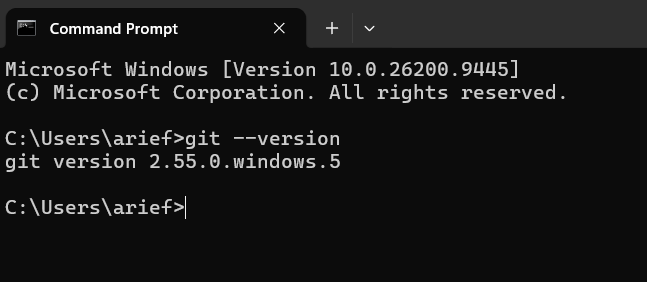
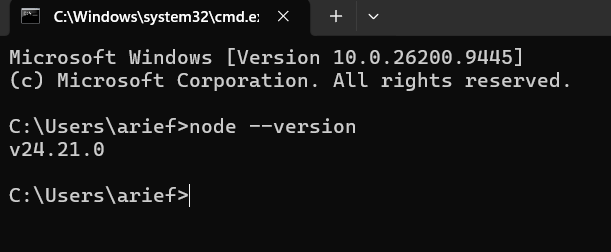
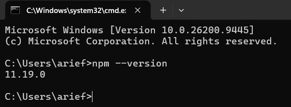
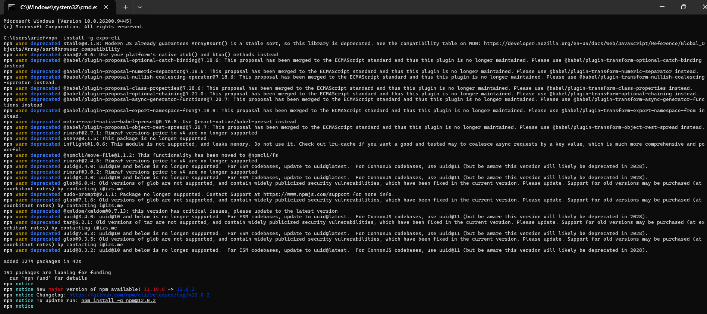
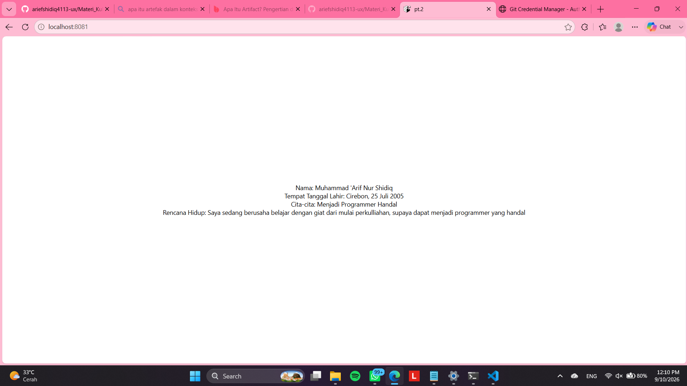

# **Praktikum Mentiapkan Memulai Mobile Programing dengan React Native** #
## **Tujuan Pembelajaran** ##
Setelah menyelesaikan modul praktikum ini, saya mampu:
- Menginstall Git dan Github
- Menginstall Node.js dan NPM
- Menginstall Expo CLI
- Membuat project React Native
- Menjalankan Project React Native

1. Install git di local
  - unduh dan install Git Via https://git-scm.com/install/windows
  - Verivikasi Git (buka cmd dan ketik "git --version")
  

2. Install Node JS
  - unduh dan install Node JS via https://nodejs.org/en/download
  - Verivy Node JS (buka cmd dan ketik "node --version")
 
 

3. Install Expo CLI
  - Bula terminal pada code editor
  - Pastikan aktif di di directory yang di tuju
  - ketikan (npx create-expo-app ptmn2 --template blank)
  

4. Menjalankan Projek React Native
  - Masuk ke directory projek "cd pt.2"
  - Jalankan projek "npx expo start"
  - Run emulator di web ketik w
  - di terminal "npx expo install react-dom react-native-web"
  npx expo start --web

5. LATIHAN PERTEMUAN-2
  - Tambahkan text berupa 
  - Nama Lengkap
  - Tempat Tanggal Lahir
  - Cita-Cita
  - Rencana Hidup
   